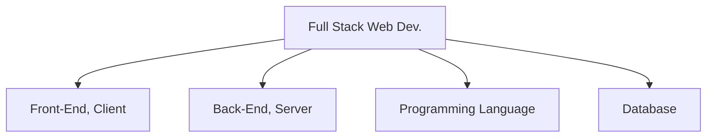
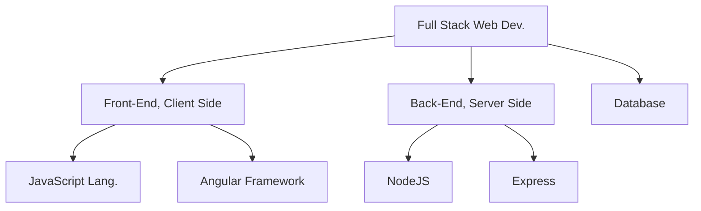
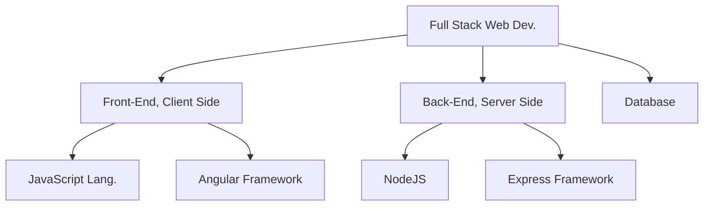

# FullStackWebDev

## Full Stack Branches 

General Logic
---

---

Expanded Logic - MEAN Stack

---

---

  

---

Expanded Logic - MERN Stack
---

---

  

---

---
Summary:
---
<table>
<tr>
<th>Expanded Logic - MEAN Stack</th>
<th>Expanded Logic - MERN Stack</th>

</tr>
<tr>
<td>

---

  

</td>
<td>
  

  

---

  

 
</td>
</tr>
</table>

---
