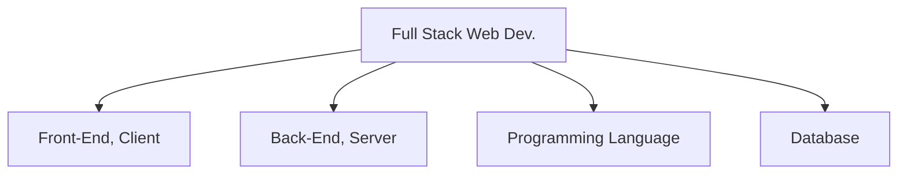
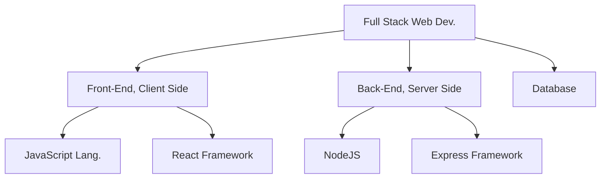
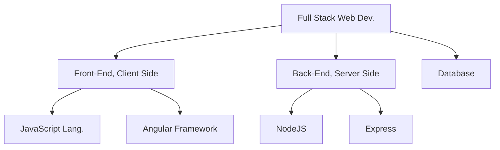

# FullStackWebDev

## Full Stack Branches 

Basic Logic

```mermaid
graph TD;
    A[Full Stack Web Dev.]-->B[Front-End, Client];
    A-->C[Back-End, Server];
    A-->D[Programming Language];
    A-->E[Database];
```

Expanded Logic - MERN Stack

  

```mermaid
graph TD;
    A[Full Stack Web Dev.]-->B[Front-End, Client Side];
    A-->C[Back-End, Server Side];
    B-->D[JavaScript Lang. ];
    B-->E[React Framework];
    
    C-->F[NodeJS];
    C-->G[Express Framework];
    A-->H[Database];
```

Expanded Logic - MEAN Stack

  

```mermaid
graph TD;
    A[Full Stack Web Dev.]-->B[Front-End, Client Side];
    A-->C[Back-End, Server Side];
    B-->D[JavaScript Lang.];
    B-->E[Angular Framework];
    
    C-->F[NodeJS];
    C-->G[Express];
    A-->H[Database];
```
